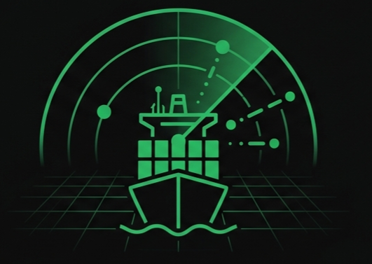

# ShipCrawler v7.3 — SSE Reconnection & Live-Task Indicator

<p align="center">
  
</p>

Maritime OSINT investigation platform that uses autonomous AI agents to identify vulnerabilities, exposed interfaces, and operational patterns on vessels worldwide. Built on the OSINT Maritime Framework methodology (IEEE Access 2026).

Real-time, phase-by-phase AI agent investigation with SSE streaming — watch each OSINT phase execute live in the browser. Persists across page refreshes with automatic SSE reconnection.

[]()
[]()
[](https://github.com/ahmdngi/shipcrawler)

---

## Quick Start (5 minutes)

```bash
# 1. Clone
git clone https://github.com/ahmdngi/shipcrawler.git
cd shipcrawler

# 2. Python environment
python3 -m venv venv
source venv/bin/activate
pip install flask requests beautifulsoup4 shodan

# 3. Start dashboard
python3 app.py

# 4. Start worker (new terminal)
python3 worker.py

# 5. Open browser
open http://localhost:9091
```

---

## Table of Contents

- [Prerequisites](#prerequisites)
- [Installation](#installation)
- [Configuration](#configuration)
- [Running](#running)
- [Usage](#usage)
- [API Reference](#api-reference)
- [Architecture](#architecture)
- [Troubleshooting](#troubleshooting)
- [Changelog](#changelog)

---

## Prerequisites

### Required
- **Python 3.10+**
- **Hermes Agent** — The AI agent runtime ([install guide](https://hermes-agent.nousresearch.com/docs))
- **API Keys**:
  - [Shodan](https://account.shodan.io/) — Internet scanning (free tier: 100 queries/month)
  - [Exa](https://exa.ai/) — Web search & extraction (free tier: 1000 queries/month)
  - [Equasis](https://www.equasis.org/) — Maritime registry (free registration)

### Optional but recommended
- **Firecrawl** — Fallback web backend for JS-heavy sites
- **CloakBrowser** — Evades bot detection on MarineTraffic/VesselFinder
- **Tavily** — Additional search fallback

---

## Installation

### Step 1: Clone the repository

```bash
git clone https://github.com/ahmdngi/shipcrawler.git
cd shipcrawler
```

### Step 2: Set up Python environment

```bash
python3 -m venv venv
source venv/bin/activate
pip install --upgrade pip
pip install flask requests beautifulsoup4 shodan
```

### Step 3: Install Hermes Agent

```bash
pip install hermes-agent
# Or follow the official guide: https://hermes-agent.nousresearch.com/docs
```

### Step 4: Install the Shipcrawler skill

```bash
hermes skills install shipcrawler
```

This gives the AI agent access to all maritime OSINT tools (Equasis CLI, Shodan Python library, AIS sources, etc.).

---

## Configuration

### Step 5: Set up API keys

Create/edit `~/.hermes/.env`:

```bash
# Shodan — required for attack surface discovery
SHODAN_API_KEY=your_shodan_key_here

# Exa — required for web search & extraction
EXA_API_KEY=your_exa_key_here

# Equasis — required for vessel registry lookups
EQUASIS_USERNAME=your_equasis_username
EQUASIS_PASSWORD=your_equasis_password

# Optional: Firecrawl (fallback web backend)
FIRECRAWL_API_KEY=your_firecrawl_key_here

# Optional: Tavily (fallback search)
TAVILY_API_KEY=your_tavily_key_here
```

### Step 6: Verify Hermes config

```bash
hermes config show
```

Make sure the web backend is set correctly:

```yaml
web:
  backend: exa              # Primary web backend
  search_backend: exa       # Search tool backend
  extract_backend: exa      # Extract tool backend
```

If not, set it:

```bash
hermes config set web.backend exa
hermes config set web.search_backend exa
hermes config set web.extract_backend exa
```

### Step 7: Set up Equasis CLI

```bash
equasis configure --setup
# Enter your Equasis username and password when prompted
```

Test it:

```bash
equasis vessel --imo 9237589
```

### Step 8: Verify Shodan

```bash
python3 -c "import shodan; api = shodan.Shodan('$SHODAN_API_KEY'); print(api.info())"
```

---

## Running

### Step 9: Start the dashboard

```bash
cd shipcrawler
source venv/bin/activate
python3 app.py
```

The dashboard runs on **port 9091**. Open `http://localhost:9091` in your browser.

### Step 10: Start the worker

In a **second terminal**:

```bash
cd shipcrawler
source venv/bin/activate
python3 worker.py
```

The worker polls `queue/pending/` every 2 seconds. When a new search is submitted via the dashboard, the worker:
1. Moves the task from `pending/` to `running/`
2. Spawns `hermes chat` with the shipcrawler skill
3. Streams progress to `queue/progress/<task_id>.log`
4. On completion, saves results to `queue/done/` and writes reports to `~/hermes-vault/osint-reports/<vessel>-report/`

### Running on a remote server

Bind to a specific IP:

```bash
# Bind to all interfaces (not recommended for production)
python3 app.py --host 0.0.0.0

# Bind to Tailscale IP for secure remote access
python3 app.py --host 100.72.133.89
```

---

## Usage

### Web Dashboard

1. Open `http://localhost:9091`
2. Enter a vessel name, MMSI, or IMO number in the search box
3. Select **Vessel OSINT** or **Person OSINT** mode
4. Click **Search**

The investigation terminal shows real-time progress:

| Badge | Meaning |
|-------|---------|
| `QUEUED` | Task is in queue, waiting for worker |
| `EQUASIS` | Equasis registry lookup |
| `SHODAN` | Shodan internet scanning |
| `AIS` | AIS tracking data collection |
| `WEB` | Web OSINT / news search |
| `REPORT` | Report generation |
| ✅ | Phase completed successfully |
| ❌ | Phase failed |

### Understanding Results

After the investigation completes, the report section shows 5 tabs:

| Tab | Content |
|-----|---------|
| **Overview** | Vessel identity, current status, port calls, operational analysis |
| **Technical** | Shodan attack surface, vulnerability assessment |
| **Red Team** | Attack vectors tailored to the vessel's profile |
| **Detection** | SIEM rules (Elastic, Zeek, Wazuh), M-SOC runbook |
| **Assessment** | Confidence and risk assessment |

The right sidebar (📄 Report Files) lets you browse individual report files:
- **📋 Analyst Report** — Full narrative with all findings
- **⚔️ Red Team Playbook** — Attack scenarios with equipment and steps
- **🔍 Detection Rules** — Elastic SIEM rules, Zeek scripts, Wazuh configs

### File Outputs

Every investigation creates a directory at `~/hermes-vault/osint-reports/<vessel-name>-report/`:

```
~/hermes-vault/osint-reports/
└── <vessel-name>-report/
    ├── analyst-report.md           # Full OSINT findings
    ├── red-team-playbook.md        # Attack scenarios
    ├── indicators-and-detection.md # Detection rules
    └── raw-output.md               # Full AI agent trace
```

---

## API Reference

| Endpoint | Method | Description |
|----------|--------|-------------|
| `/` | GET | Dashboard UI |
| `/api/search` | POST | Submit search task |
| `/api/status/<task_id>` | GET | Check task status |
| `/api/stream/<task_id>` | GET | SSE stream of phase progress |
| `/api/report/<task_id>` | GET | Get full report data |
| `/api/report/by-name/<name>` | GET | Lookup report by vessel/person name |
| `/api/history` | GET | List all past reports |
| `/api/health` | GET | Queue health check |

### Submit a search

```bash
curl -X POST http://localhost:9091/api/search \
  -H "Content-Type: application/json" \
  -d '{"name": "EVA 316", "mode": "vessel", "context": ""}'
```

Returns:
```json
{"task_id": "a1b2c3d4", "mode": "vessel", "status": "queued"}
```

### Stream progress (SSE)

```bash
curl -N http://localhost:9091/api/stream/a1b2c3d4
```

Events: `queued` → `phase_start` → `phase_output` → `phase_complete` → `report_complete` → `done`

### Get report

```bash
curl http://localhost:9091/api/report/a1b2c3d4
```

---

## Architecture

```
User submits search → queue/pending/
  └── Worker picks up task, runs phases sequentially:
       ├── Phase 0: Equasis Vessel Identity
       ├── Phase 1: Target Identification (AIS)
       ├── Phase 2: Attack Surface Discovery (Shodan)
       ├── Phase 3: Vulnerability Assessment
       ├── Phase 4: Threat Intelligence
       └── Phase 5: Report Generation

Each phase → AI agent with shipcrawler OSINT skills
  ├── Writes progress to queue/progress/<task_id>.log (JSON Lines)
  ├── Frontend reads via SSE at /api/stream/<task_id>
  └── Reports saved to ~/hermes-vault/osint-reports/
```

### Components

| Component | File | Role |
|-----------|------|------|
| **Flask Dashboard** | `app.py` | Web UI, API endpoints, SSE streaming |
| **Queue Worker** | `worker.py` | Polls queue, spawns AI agents |
| **Progress Logger** | `worker_progress.py` | JSON Lines log writer/reader |
| **Report Renderer** | `renderer.py` | Structured report parser |
| **Frontend SSE** | `static/js/shipcrawler-sse.js` | EventSource client |
| **Frontend Core** | `static/js/shipcrawler-core.js` | UI logic, terminal, modals |
| **Frontend UI** | `static/js/shipcrawler-ui.js` | Theme editor |

### Directory Layout

```
shipcrawler/
├── app.py                    # Flask application
├── worker.py                 # Queue worker daemon
├── worker_progress.py        # Progress log writer
├── renderer.py               # Report renderer
├── routes/
│   └── api.py                # API route definitions
├── templates/
│   └── index.html            # Single-page dashboard
├── static/
│   ├── css/
│   │   └── shipcrawler.css   # All styles
│   └── js/
│       ├── shipcrawler-sse.js    # SSE streaming client
│       ├── shipcrawler-core.js   # Core UI logic
│       ├── shipcrawler-ui.js     # Theme editor
│       └── globe.js              # Three.js globe animation
└── queue/
    ├── pending/              # Tasks waiting for worker
    ├── running/              # Tasks currently being processed
    ├── progress/             # Phase progress logs
    └── done/                 # Completed task metadata
```

---

## Troubleshooting

### "No report found" when loading from history

Old reports (pre-v6.4e) don't have phase files. The dashboard falls back to counting report files. If a report directory exists but shows 0 phases, verify the directory:

```bash
ls ~/hermes-vault/osint-reports/<name>-report/
```

### Worker not picking up tasks

```bash
# Check worker is running
ps aux | grep worker.py

# Check queue
ls queue/pending/
ls queue/running/

# Restart worker
kill $(pgrep -f worker.py)
python3 worker.py &
```

### "The file was truncated by bash parsing errors"

The AI agent tried to write a large file via bash heredoc. Fixed in v6.4e — the prompt now instructs the agent to always use Python `open().write()` for file creation.

### SSE stream shows "queued" but never progresses

The task is in `queue/pending/` but the worker is busy with another task. The worker processes one task at a time. Check:

```bash
ls queue/running/   # Current task
ls queue/pending/   # Queued tasks
```

### Equasis "VESSEL NOT FOUND" error

This usually means rate-limiting, not absence of data. Wait 30-60 seconds and retry. The CLI's login check falsely passes even when throttled.

### Shodan returns no results

Some vessels have zero internet-facing footprint — this IS a valid finding (low attack surface). For a more thorough check, try searching by MMSI, callsign, and owner name.

### Hermes API key issues

Ensure all API keys are set in `~/.hermes/.env` and verify with:

```bash
hermes config show | grep -i 'exa\|shodan\|firecrawl\|tavily'
```

---

## Changelog

### v6.4g
- **Panels collapsed by default** — sidebar and right panel start closed on every fresh load; state persists via localStorage
- **Right panel localStorage** — toggle state now persists like the sidebar (was missing before)
- **PWA support** — manifest.json, service worker (cache-first static assets), 192×192 & 512×512 PNG icons
- **Apple PWA meta** — `apple-mobile-web-app-capable` and `apple-mobile-web-app-title` tags
- **Mobile responsive** — tablet (<1024px) and phone (<768px) breakpoints: zero body margins, panels as sliding overlays, single-column grids, scaled hero/terminal/nav
- **Mobile FABs** — floating action buttons bottom-left/right on phone for opening collapsed panels
- **Templates auto-reload** — `TEMPLATES_AUTO_RELOAD` enabled in app.py for dev
- **Tool call breakdown** — summary bar shows per-category tool usage (search:5 · shodan:3 · terminal:12) on investigation completion

### v6.4f
- **Color theme system** — three presets (Dark, Classic, Oversight) with switcher in nav bar, replacing old color picker modal
- **Oversight theme** — light beige background with green accents, JetBrains Mono + Inter fonts
- **Classic theme** — dark with green accent palette
- **Live theme switching** — no reload needed; all panels, terminal, and modal adopt theme instantly
- **SEO & meta enrichment** — Open Graph, Twitter Card, JSON-LD structured data, description, keywords, author, canonical URL, theme-color

### v6.4e
- **Queued state** — SSE stream now emits `queued` event when task is in pending queue. Frontend shows position (e.g. "In queue (position 2 of 3)")
- **Report files sent individually** — API now sends `analyst-report.md`, `red-team-playbook.md`, `indicators-and-detection.md` as separate entries, not concatenated
- **Report modal widened** — 1200px max-width with proper table styling (borders, header row, alternating rows)
- **Summary bar from history** — clicking an old investigation updates phases/time/files stats instead of showing 0s
- **Terminal widened** — 1200px max-width, more room for phase output
- **Total Time in minutes** — summary bar shows minutes instead of raw seconds
- **No bash heredocs** — worker prompt tells agent to use Python `open().write()` for file creation
- **Web backend: Exa** — changed default backend from Firecrawl to Exa
- **Favicon** — changed to green for better visibility

### v6.4d
- **History deduplication** — normalized task IDs to report directory names everywhere
- **Sidebar active state** — fixed so clicking a history item shows visual feedback
- **API as source of truth** — history sidebar refreshes from API, localStorage is fallback
- **Bugfix: search button not responding** — missing `shipcrawler-ui.js` script tag
- **Bugfix: terminal stream rendering below prompt** — appendChild targeting wrong element
- **Filler frames** — instant progress messages before AI agent starts

### v6.4c
- **Fixed `/api/history` crash** — missing `import os`
- **Auto-load last report on refresh** — most recent report reappears without new search

### v6.4b
- **Missing script tag fix** — search button was unresponsive
- **Terminal stream fix** — phase lines now render inside terminal body
- **Static prompt removed** — blinking cursor disappears when stream starts

### v6.3b
- Repo renamed to `shipcrawler` (v3 deprecated)
- New `/api/history` endpoint
- Worker raw vs clean separation
- Name sanitization for `/api/report/by-name/`
- `md-block` for markdown rendering

### v6.3
- Real-time tool-call streaming via Popen
- Colored phase badges by tool type
- Live phase timer with pulse animation
- Comprehensive single-session agent reports

---

## Related

- **[Shipcrawler-Parallel](https://github.com/ahmdngi/shipcrawler)** — Multi-agent variant for bulk vessel investigations
- **Project Haris** — Maritime edge security platform (defensive counterpart)
- **OSINT Maritime Framework** — "A Proactive Defense: An Open-Source Intelligence (OSINT) Framework for Maritime Cybersecurity" — IEEE Access, vol. 14, 2026. DOI: [10.1109/ACCESS.2026.3673557](https://doi.org/10.1109/ACCESS.2026.3673557)
